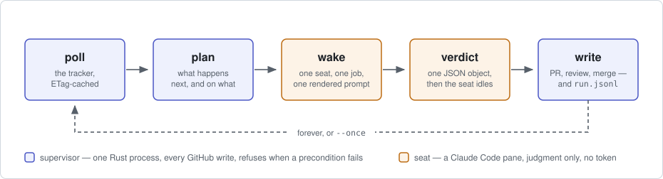

# fwf

A software factory for a GitHub repository, run by one supervisor: seats are
woken with one job and answer with one verdict.

[](https://github.com/tbaums/fun-with-friends/actions/workflows/one-ci.yml)
[](https://github.com/tbaums/fun-with-friends/actions/workflows/one-release.yml)
[](https://github.com/tbaums/fun-with-friends/releases)
[](one/Cargo.toml)
[](LICENSE)
[](#the-prompts-are-the-product)

## What it does

fwf reads a GitHub tracker, decides what should happen next, and wakes one idle
Claude Code pane with exactly one job. That seat does the work in its own git
worktree and answers with a single JSON verdict, then goes idle again. The
supervisor reads the verdict as data and performs every GitHub write itself,
acting as three narrow App identities: one that opens pull requests, one that
reviews them, and one that merges, labels and releases. Seats never hold a
GitHub token — their only remote is a bare mirror on the same machine, so a
seat that goes wrong can write a bad branch locally and nothing more. Every
decision, refusal and verdict is appended to one run record, and every view of
the factory is a fold over that file.



## Ten-minute start

You need macOS or Linux with `tmux`, `git` and a stable Rust toolchain, a Claude
subscription, and [three GitHub Apps](docs/github-apps.md) installed on the
repository with their keys in `~/.fwf/keys/` and ids in `~/.fwf/apps.toml`.

```sh
git clone https://github.com/tbaums/fun-with-friends && cd fun-with-friends
./install.sh                 # builds one/ and puts `fwf` on your PATH
fwf version                  # fwf 1.0.2
```

Write the manifest — the only launch input — into the repository you want
worked, then validate it and mint every App:

```sh
mkdir -p .fwf && fwf init-manifest > .fwf/fwf.toml
$EDITOR .fwf/fwf.toml        # set repo, and list the issues you want worked
fwf up                       # validates, mints each App, prints the floor plan
```

`fwf up` prints the plan and stops on the first thing that is not ready, naming
it:

```
manifest ./.fwf/fwf.toml ok: repo tbaums/fun-with-friends · staging → main
  · gate label "product-wip" · 1 pair(s) · session fwf-one · venue local (8 GB, 1800 s)
fwf up: no apps config at ~/.fwf/apps.toml
```

Then bring up the floor and run the loop:

```sh
fwf seats --up               # mirror, one worktree per seat, a warm pane each
fwf run --once               # one tick: poll → plan → act
fwf run                      # the loop
fwf dash --watch 30          # the board: seats · issues · PRs · decisions · usage
```

`fwf dash` has five tabs (`1`-`5`, or `--tab issues`), `j`/`k` to move the
selection, `r` to refresh, `q` to quit. Every pane is folded from the run
record; the only live reads are tmux pane liveness and the meter.

## The prompts are the product

Once coordination is removed from the agent, what is left in a prompt is the
role's judgment: what a good implementation is, what a review must check, what
a spec must contain, what makes a ticket ready. These are the most valuable
files here, and they are short enough to read in an afternoon.

Each is a contract rather than a conversation. It names what the seat is given
(the issue, the branch to create, the commit to build on, the deadline), what
it may not do, and the one verdict shape it must return. The supervisor fills
only the placeholders it knows — `{{SEAT}}`, `{{REPO}}`, `{{ISSUE}}`, `{{TITLE}}`, `{{BODY}}`, `{{BRANCH}}`, `{{PR}}`, `{{HEAD}}`,
`{{BASE}}`, `{{CHECK}}`, `{{REVIEW}}`, `{{DEADLINE}}` — and a test refuses any file
that uses one it does not fill, so a typo can never reach a seat as a literal
placeholder. A verdict is data: `implemented` with a head sha becomes a pull
request, `blocked` releases the claim, a QA verdict becomes a review under the
QA identity. Nothing a seat writes is a write to GitHub by itself.

A family only overrides the roles whose judgment differs; anything it does not
define falls back to `dev`.

| family | impl | qa | gv | pm | rework |
|---|---|---|---|---|---|
| `consulting` | [impl](prompts/consulting/impl-job.md) | [qa](prompts/consulting/qa-job.md) | [gv](prompts/consulting/gv-job.md) | · | · |
| `defect-report` | [impl](prompts/defect-report/impl-job.md) | [qa](prompts/defect-report/qa-job.md) | · | · | · |
| `dev` | [impl](prompts/dev/impl-job.md) | [qa](prompts/dev/qa-job.md) | [gv](prompts/dev/gv-job.md) | [pm](prompts/dev/pm-job.md) | [rework](prompts/dev/impl-rework.md) |
| `ideation` | [impl](prompts/ideation/impl-job.md) | [qa](prompts/ideation/qa-job.md) | [gv](prompts/ideation/gv-job.md) | · | · |
| `refactor` | [impl](prompts/refactor/impl-job.md) | [qa](prompts/refactor/qa-job.md) | · | · | · |
| `user-testing` | [impl](prompts/user-testing/impl-job.md) | [qa](prompts/user-testing/qa-job.md) | · | · | · |
| `validate` | [impl](prompts/validate/impl-job.md) | [qa](prompts/validate/qa-job.md) | [gv](prompts/validate/gv-job.md) | · | · |

[`one/prompts/README.md`](prompts/README.md) explains the families and the
fallback rule, and records which coordination the port removed rather than
translated.

## What is enforced, not asked

These are refusals in code with tests, not instructions in a prompt. Each one
prints what it refused and why, and the refusal is recorded.

- **A merge needs an approval at the exact head being merged**, by someone other
  than the author, plus a live claim fence matching the commit the work was
  built on, plus completed checks on that head. A review made one commit ago is
  not an approval of this one.
- **Only a human un-gates.** A model may gate an issue; `fwf ungate --by NAME`
  is the only thing that makes it eligible, and the record names who.
- **A promotion needs a recorded green gate for that literal SHA.** A gate
  result for a different commit, or a stale one, is refused rather than
  reinterpreted.
- **Seats cannot write to GitHub.** No token in the pane, `gh` and `curl`
  denied by hooks, and the only remote a local bare mirror.
- **Nothing is inferred from pane text.** A seat answers with one JSON verdict
  file, written atomically; a missing verdict is `Stalled`, never guessed.
- **The meter brakes the floor.** `run` parks at `park_at_weekly_pct` from the
  last real reading, and parks on a stale one.
- **The record is append-only.** `fwf` never edits `run.jsonl`; `why`, `status`,
  `dash` and cost are all folds over it.

## Verbs

| verb | what it does | identity |
|---|---|---|
| `up`, `doctor`, `status`, `dash`, `why <pr>`, `cost`, `version` | read-only: validate and mint, one-screen status, the five-tab board, one PR's timeline, measured tokens | - |
| `seats --up/--down` | mirror, worktree clones and warm panes; `--down` refuses while a seat is Working | - |
| `init-manifest` | print an example manifest, or convert an existing profile | - |
| `run [--once]` | the supervisor loop; only allow-listed issues; parks on the meter brake | all three |
| `spec --issue N` | wake the PM seat on a gated issue; its spec is written into the issue, gate untouched | ops |
| `triage --issue N` | wake the GV seat; a not-ready verdict gates the issue | ops |
| `ungate --issue N --by NAME` | the one human decision, made mechanical and recorded | ops |
| `slice --issue N` | wake an impl seat, send its branch to the mirror, open the draft PR | ops, impl |
| `qa --pr N` | wake a QA seat; post its verdict as a review anchored to the head | qa |
| `review --pr N --by R` | a review under a named identity, anchored to the current head | any |
| `merge --pr N` | typed squash-merge: approval at head by a non-author, fence, checks | ops |
| `gate --sha S --suite X` | run a suite in a venue, record the verdict, post a check-run | ops |
| `promote --from A --to B` | fast-forward by literal SHA, only on a recorded green | ops |
| `release-check --tag T` | refuse unless the tag has a release object with the expected assets | ops |
| `mirror-init`, `probe`, `ready` | refresh the local mirror; GET an API path as one App; mark a draft PR ready | varies |

`fwf <verb>` with no arguments prints the exact flags.

## Design

fwf runs a software factory on a GitHub repository. The factory has two kinds of parts. There is one **supervisor** (`fwf run`), a small Rust program that reads the tracker, decides what should happen next, and performs every write to GitHub. And there are **seats**: Claude Code sessions sitting in tmux panes, each of which is idle until the supervisor wakes it with exactly one job, and idle again the moment it has answered.

That split is the whole design. Everything else follows from asking two questions about each responsibility: *does this need judgment, or does it need to be right every time?* Judgment goes to a seat. Being right every time goes to the supervisor.

Deciding whether an issue is well-grounded, whether a spec is complete, how to implement a change, whether a diff is correct: judgment, so a seat does it. Which issue is next, which branch a change must be built on, whether a review counts, whether a merge is allowed, whether a gate passed, what the meter says: those must be right every time, so the supervisor does them in code, with tests, and refuses loudly when a precondition fails.

[`docs/design.md`](docs/design.md) is the rest of the argument: why seats are
woken and never left running, why the prompts are the product, the three narrow
identities, fences and typed merges, the run record, and the meter.

## Documentation and license

- [`one/README.md`](one/README.md) — the detailed guide: layout, every flag, the
  full enforcement list.
- [`one/docs/github-apps.md`](docs/github-apps.md) — registering the three
  Apps with their minimal permissions.
- [`one/RELEASING.md`](docs/releasing.md) — cutting a release.
- [`one/CHANGELOG.md`](CHANGELOG.md) — what shipped in each 1.0 version.

[MIT](LICENSE) © 2026 Jamie Tanenbaum. What the three App identities can and cannot do, and how to report a problem, is in [`SECURITY.md`](SECURITY.md).

## Legacy

The v0.42 bash factory ships as `fwf-legacy`; its docs are under `docs/legacy/`.
