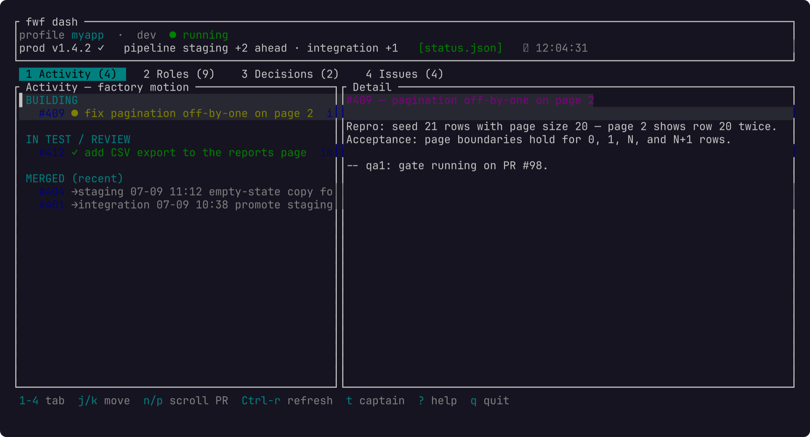

# `fwf dash` — the status board + decision inbox



*The dash rendered against sample data — the Activity landing tab plus the detail
pane for the selected PR.*

A compiled Rust + ratatui TUI (the `dash/` crate) that shows the factory at a
glance and lets you act on the gated decisions without leaving the keyboard.
`fwf dash` resolves the profile, finds a runnable `fwf-dash` binary (the gh-dash
model — a bash tool shelling out to a compiled dashboard), points it at the bash
data/action layers, and execs it.

```
fwf dash                  # the only profile, or pass --profile NAME
fwf dash --profile myapp
fwf --profile myapp dash
```

`--profile` (and `--profile=NAME`) work before or after the subcommand —
whichever position you naturally reach for (issue #69).

Requirements: `jq` (the data provider). A Rust toolchain (`cargo`) is **not**
required when a prebuilt binary is available for your platform — see *Binary
resolution* below.

## Binary resolution (issue #63)

`fwf dash` resolves a runnable binary in this order, stopping at the first hit:

1. **`FWF_DASH_BIN`** — if set, it's used verbatim (no download, no build). A
   missing path surfaces a "no runnable binary" error rather than falling back.
2. **Cached arch+version binary** — `~/.fun-with-friends/cache/dash/fwf-dash-<version>-<slug>`.
   The cache key embeds the installed `VERSION`, so `fwf upgrade` automatically
   re-resolves rather than running a stale binary.
3. **Release asset download** — the matching prebuilt binary is downloaded from
   the GitHub Release for this `VERSION`, **sha256-verified against the published
   `fwf-dash-<version>-checksums.txt`**, cached, and run. A failed checksum or
   missing asset is ignored and resolution falls through. Uses `curl` (or `wget`)
   against the public release URL — no `gh`/token required.
4. **Source build** — the original first-run behavior: `cargo build --release` in
   `dash/`. This is the offline / unsupported-platform fallback and requires
   `cargo` — and a git-clone install (the release tarball doesn't ship the
   `dash/` crate source). **Intel Macs (`x86_64`) land here**: they are not a
   prebuilt target (see below), so `fwf dash` builds from source on first run,
   or prints a clear "install Rust / set `FWF_DASH_BIN`" message if `cargo`
   is absent — it never attempts a doomed download.

The `<slug>` is derived from `uname -s`/`uname -m`. Prebuilt targets:

| Host | slug |
|---|---|
| macOS Apple Silicon | `darwin-arm64` |
| Linux x86_64 | `linux-x86_64` |
| Linux arm64 | `linux-arm64` |

macOS Intel (`x86_64`) is **not** a prebuilt target — `fwf dash` builds it from
source (step 4 above).

Prebuilt binaries are produced and uploaded by the release workflow
(`.github/workflows/release.yml`) when a `vX.Y.Z` tag is pushed. Trust is rooted
in GitHub Releases over TLS plus the sha256 checksum (which guards against a
corrupted/mismatched download); GPG signing is not done in v1.

## What it shows

Derived-first, so it works with the factory **parked** — nothing here depends on
a running swarm:

| Field | Derived from |
|---|---|
| activity | open/merged PRs against the integration targets: BUILDING / IN TEST·REVIEW / MERGED (the landing tab) |
| roles | tmux pane liveness (`@l` label + current command): live / idle / down — or **IDLE (captain)** for a floor role deliberately parked by `fwf-down.sh --floor-only`, never conflated with a crash (see below) |
| pipeline | git branch deltas in the target repo (`staging +N ahead · …`) |
| decisions | the label protocol: open + `product-wip` + a `GV-SIGNOFF` comment ⇒ awaiting you |
| issues | every open issue (gated ones marked 🔒) |
| prod | the captain's `status.json` overlay when fresh, else `—` |
| ⛔ CAPTAIN NEEDS YOU | a full-width banner when the captain pane is blocked on you (read from the captain pane) |
| ◇ FLOOR IDLE (header badge) | shown whenever the floor was deliberately idled via `fwf-down.sh --floor-only` — distinct from the whole-factory `⏸ PARKED` badge |
| ⬆ upgrade available | a full-width banner (visually distinct — yellow, not red) when a newer fwf release exists; both this and the needs-you banner can show at once, stacked. See "Upgrade staleness check" in the main README's Notes & caveats. |

A role with no live tmux pane reads as a real crash (`down`) UNLESS the last
entry in `$FWF_STATE_DIR/floor-events.log` is a `floor-down` with no later
`floor-up` — that append-only, 200-line-capped log is the single source of
truth for both this live signal and the after-the-fact audit trail of who
idled the floor, when, and why. `fwf-down.sh --floor-only` writes it (`--actor
NAME`, `--reason "TEXT"` — defaults `captain` / `queue empty; nothing in
flight`); every up-path (`fwf-up.sh --floor-only`, a full `fwf up`, and
respawning any floor role) clears it. The captain itself is excluded — it's
the one role `--floor-only` never tears down, so a captain with no pane is
always a real `down`.

`fwf-down.sh --floor-only` also enforces a deterministic anti-thrash cooldown
(issue #88): it refuses (nonzero exit, naming the remaining seconds) within
`FWF_FLOOR_COOLDOWN` seconds (default 300) of the last logged floor-up, unless
`--force` is passed — this is what actually bounds a down→up→down thrash
cycle, since it cannot be defeated without `--force`.

The header's provenance stamp says where prod/pipeline came from: `status.json`
(fresh overlay, green), `stale` (overlay too old, amber), or `derived` (gray).

## Keys (no F-keys — the prior-art model)

| Key | Action |
|---|---|
| `1` `2` `3` `4` `5` · `Tab` / `Shift-Tab` · `[` `]` | switch section (Activity / Roles / Decisions / Issues / Usage) |
| `j` `k` · `↑` `↓` | move the list cursor |
| `g` `G` | first / last row |
| `PgUp` `PgDn` · `Ctrl-u` `Ctrl-d` · wheel | scroll the detail preview |
| `Ctrl-r` | force a data refresh now (it also auto-refreshes on a timer) |
| `?` | help overlay |
| `q` · `Esc` | quit |

Actions (the verb depends on the active section):

| Section | Key | Action |
|---|---|---|
| Decisions | `y` / `x` | approve (un-gate + go-ahead) / reject — **confirms first** |
| Decisions, Issues | `c` | comment — opens an inline text field |
| Decisions, Issues | `o` | open in the browser (gh) / shows the detail (local) |
| Roles | `r` / `s` | respawn the role / stop the whole swarm — **confirms first** |
| anywhere | `n` `p` | scroll the detail / PR preview |
| anywhere | `t` | send a line to the captain pane (text field) |

`y` un-gates by removing the `product-wip` label and posting the standard
go-ahead, so the captain reacts on its next tick exactly as if you'd typed in
the issue. Actions run on a worker thread; the result shows in a colour-coded
status line and the board refreshes.

## Usage tab (issue #95)

A 5th, read-only section: per-role token usage + an estimated $ equivalent,
summed from each role's own Claude Code session transcripts. On its own data
thread and a slower default refresh (`FWF_USAGE_REFRESH`, default 60s) than
the rest of the board, since summing transcripts is a heavier read than the
gh/tmux-derived data above — `Ctrl-r` forces both to refresh together.

Each role shows one of three states, never collapsed to two:

| State | Meaning | Shown as |
|---|---|---|
| FRESH | this poll read the role's transcripts successfully | the live token/$ figures |
| STALE | a prior good read exists, but this poll couldn't refresh it | `⚠ STALE (Ns ago)` + the **last-good** figures (never a frozen blank) |
| UNKNOWN | never successfully read (missing dir / no data yet) | `⚠ UNKNOWN` and `-` throughout (never `$0`, which would misread as confirmed no-spend) |

The $ figures are an **engineering proxy** — fwf panes run under a Claude
subscription session, not a metered API key, so this is "API-cost-equivalent
spend," not a reading of the account's actual rolling-window usage. That
caveat is always visible in the tab (and in `fwf usage`'s CLI output). See
`docs/proposals/70-token-usage-budget.md` for the full design rationale;
`fwf doctor` includes a smoke-test that catches a Claude Code transcript
format drift before it would silently under-report here.

For a terminal-only view of the same data (no TUI needed): `fwf usage` — a
per-role table plus a factory total, printed once and exited (see `fwf help`).

### Budget enforcement (issue #96, #108)

The tab also shows the current hard-budget status (see the README's
"Token budget enforcement" section for the full design): a
**budget enforcement: ARMED (ceiling $N USD | N tokens) / NOT ARMED** line, a
**this run: … since fwf up — cumulative: …** line once a run-start baseline
exists, and the current hold state — `none`, a `HOLD` (this-run spend over
the ceiling), a `WARN` (approaching the ceiling, not paused), or an
`UNKNOWN — FAIL-CLOSED` (a role's usage reader, or the run-start baseline,
broke; textually distinct from `HOLD` so it's never misread as "over
budget"). This mirrors `fwf usage`'s own lines exactly, so the two surfaces
never disagree. NOT ARMED with a ceiling set means the budget was configured
after the factory was last brought up — re-run `fwf up` to arm the
enforcement WRITER. Lift a HOLD/UNKNOWN with `fwf usage --clear-hold` (or
raise the ceiling and let the WRITER re-evaluate on its next tick).
Enforcement counts the delta since this run's `fwf up`, not the lifetime
cumulative total — a `--floor-only` bounce or a respawn preserves that
baseline (same run), and only a full `fwf down` clears it for the next full
`fwf up`.

## Architecture

The binary is purely the renderer + input layer. Both sides stay in bash so the
gh/local backend abstraction, profile resolution, and the tests live in one
place:

- **`fwf-dash-data.sh`** — emits the whole dashboard as one JSON doc (read-only;
  never mutates). The binary shells out to it on the refresh timer.
- **`fwf-dash-act.sh`** — the write side (approve/reject/comment/open/respawn/
  stop/passthrough). Every mutation funnels through a `_run` seam:
  `FWF_DASH_DRYRUN=1` prints `DRYRUN: <argv>` instead of executing it (a real
  `--dry-run`, and what the hermetic tests assert on). In local-issues mode
  writes route to `fwf-issues.sh` and never reach gh.

### Tests

`cd dash && cargo test` runs the full Rust suite: `App`/key-handling/action
unit tests plus render/golden snapshots (issue #54) that render the main
screens (header, tabs, activity list, detail pane, needs-you banner, confirm
and input overlays) via `ratatui::backend::TestBackend` at a fixed size from a
static fixture, and compare against the stored text goldens under
`dash/tests/goldens/`. The two known styling regressions — #50 (blockquote
must not be `DarkGray`) and #51 (header must show the running template) — are
pinned by explicit style assertions alongside the goldens, so a blind re-bless
can't silently reintroduce them.

To re-bless a golden after an intentional layout/content change:

```sh
cd dash
UPDATE_GOLDEN=1 cargo test golden_   # or a specific test name
git diff tests/goldens/              # review before committing
```

See `dash/tests/goldens/README.md` for details.

### Environment

| Var | Effect |
|---|---|
| `FWF_DASH_REFRESH` | auto-refresh seconds (default 5, floor 1) |
| `FWF_DASH_BIN` | use this binary verbatim; skip download + build entirely |
| `FWF_DASH_CACHE_DIR` | where downloaded binaries are cached (default `~/.fun-with-friends/cache/dash`) |
| `FWF_DASH_NO_DOWNLOAD` | skip the release-asset download step (cache/source only) |
| `FWF_DASH_RELEASE_BASE` | base URL for release assets (test seam; default GitHub) |
| `FWF_DASH_DRYRUN` | actions print their constructed command instead of running |
| `FWF_DASH_STALE_SECS` | how old `status.json` may be before it's `stale` (default 90) |
| `FWF_USAGE_REFRESH` | Usage tab auto-refresh seconds (default 60, floor 5) |
| `FWF_USAGE_STALE_SECS` | how old a role's last successful usage read may be before it's `STALE` (default 180) |
| `FWF_CLAUDE_PROJECTS_DIR` | override for Claude Code's `~/.claude/projects` (test seam) |

### `status.json` (optional captain overlay)

`~/.fun-with-friends/state/<profile>/status.json`, written by the captain. When
fresh (by mtime) it overlays prod/pipeline, per-role detail, decision
recommendations, and any release-kind decisions; when stale or absent the board
falls back to the derived values. Shape:

```json
{
  "prod": "v0.16.0 ✓",
  "pipeline": "staging +3 ahead",
  "roles":     [ { "id": "impl1", "issue": 441, "title": "auth refactor" } ],
  "decisions": [ { "issue": 384, "recommendation": "ship" },
                 { "kind": "release", "id": "REL", "gv": "GV ✓✓", "title": "v0.7.0", "body": "…" } ]
}
```

### Launch-socket resolution (issue #62, supersedes #57)

The factory's tmux sessions land on whatever socket `$TMUX` pointed to when
`fwf up` (or `fwf respawn`) launched them — a bare `tmux new-session`/
`split-window` inherits the caller's socket, so a factory started inside
`tmux -L mysock` (or `-S <path>`) never ends up on the *default* socket. The
dash's own `$TMUX` isn't a reliable proxy either — the dash binary can be
displayed inside a completely different tmux (e.g. a separate socket used
purely for mouse-wheel forwarding).

So `fwf up`/`fwf start` (and `fwf respawn`) persist the launch socket as the
single source of truth, and `fwf-dash-data.sh` reads it back instead of
guessing:

- **Field:** `FWF_TMUX_SOCKET` — either a socket path, or the literal marker
  `default` (meaning "run tmux with no `-S` flag"; never an empty string).
- **File:** `~/.fun-with-friends/state/<profile>/tmux_socket` (next to
  `status.json`, one value per line).
- **`fwf respawn`** re-captures the socket from its own `$TMUX` when it has
  one; if it runs outside tmux (e.g. from a script/cron), it leaves the
  persisted value untouched rather than blanking it.
- **Migration:** a factory started before this field existed has no
  `tmux_socket` file. The dash falls back to probing its own `$TMUX` socket
  first, then the default socket, and uses whichever actually has the
  factory's sessions — so an already-running factory keeps working with no
  restart required.
- **Teardown:** `fwf down` (full, non-`--floor-only`) clears the file
  alongside the running-template marker.
